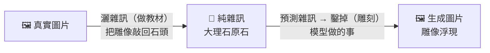

## 一句話

模型像雕刻家——不是「加上」畫面，而是從雜訊裡「鑿掉」不屬於畫面的部分。

米開朗基羅說：**「大衛本來就在大理石裡，我只是把不屬於他的部分去掉。」**

擴散模型做完全一樣的事。最終畫面本來就藏在雜訊裡——模型每一步預測「哪些是雜訊」，鑿掉它。鑿夠多次，畫面浮出來。

## 訓練：讓模型學會「什麼該鑿」

模型要先會分辨「大理石」和「雕像」。方法：拿真實圖片，用數學公式一步一步往上灑高斯雜訊（Gaussian Noise），灑到最後什麼都看不見——就像把雕像敲回大理石原石。每一步加多少雜訊是固定公式，不需要學習。

這是**人類做的事**，不是模型。目的：產生成千上萬組「雜訊圖 → 乾淨圖」配對，當作**訓練教材**。模型看著這些教材學會一件事：**「給我一張髒圖，我能指出髒在哪。」**



▲ 左半＝人類做教材（雕像→石頭） · 右半＝模型做雕刻（石頭→雕像）

## 生成：一刀一刀，把畫面從雜訊裡鑿出來

訓練完後，給模型一團純雜訊。它做的事很單純：

1. 看著現在這團雜訊，預測「這一步有哪些是雜訊」
2. 把雜訊鑿掉（減去預測的雜訊）
3. 重複，直到雜訊清乾淨，畫面浮出來

這就是**預測雜訊（Noise Prediction）**——模型不是一筆一筆「畫出」畫面，而是一刀一刀「去掉」不屬於畫面的東西。和 Stable Diffusion、Seedance 2.0 的實際運作方式一致。

```
訓練：   真實圖片 ──灑雜訊──→ 模糊一點 ──再灑──→ 更糊 ──→ ... ──→ 一團雜訊（大理石原石）
         （人類用數學公式，純手工做教材）

生成：   一團雜訊 ──鑿一刀──→ 浮現輪廓 ──再鑿──→ 光影出來 ──→ ... ──→ 最終畫面（雕像）
         （模型做的事：反覆「找雜訊→鑿掉」。一刀一刀，像雕刻）
```

:::tip[🎬 導演要點]
**Steps（鑿幾刀）** 太少 → 雜訊沒清乾淨，畫面模糊。太多 → 浪費時間，通常 **20–30 步**足夠。

去噪**前段**（前幾刀）決定構圖、姿態、光影方向。**後段**（後幾刀）決定皮膚紋理、衣服褶皺。調參數就是在決定「前段鑿大力一點還是後段鑿細一點」。

Prompt、參考圖、ControlNet = 告訴模型「雜訊在哪，往哪個方向鑿」。
:::

:::note[📖 引用論文]
[DDPM (Ho et al., NeurIPS 2020, §2–3)](https://arxiv.org/abs/2006.11239) — 前向加噪的數學定義與反向去噪的訓練目標。

[LDM (Rombach et al., CVPR 2022, §3)](https://arxiv.org/abs/2112.10752) — 實際生成時只用反向去噪，在潛在空間中執行。
:::
